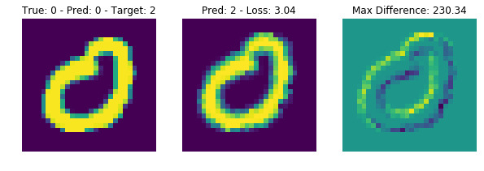

stAdv: Spatially Transformed Adversarial Examples with TensorFlow
=================================================================

Deep neural networks have been shown to be vulnerable to
`adversarial examples <https://blog.openai.com/adversarial-example-research/>`_:
very small perturbations of the input having a dramatic impact on the
predictions. In this package, we provide a
`TensorFlow <https://www.tensorflow.org/>`_ implementation for a new type of
adversarial attack based on local geometric transformations:
*Spatially Transformed Adversarial Examples* (stAdv).

Our implementation follows the procedure from the original paper:

    | Spatially Transformed Adversarial Examples
    | Chaowei Xiao, Jun-Yan Zhu, Bo Li, Warren He, Mingyan Liu, Dawn Song
    | `ICLR 2018 (conference track) <https://openreview.net/forum?id=HyydRMZC->`_, `arXiv:1801.02612 <https://arxiv.org/abs/1801.02612>`_

If you use this code, please cite the following paper for which this
implementation was originally made:

    | Robustness of Rotation-Equivariant Networks to Adversarial Perturbations
    | Beranger Dumont, Simona Maggio, Pablo Montalvo
    | `ICML 2018 Workshop on "Towards learning with limited labels: Equivariance, Invariance, and Beyond" <https://sites.google.com/site/icml18limitedlabels>`_, `arXiv:1802.06627 <https://arxiv.org/abs/1802.06627>`_

Installation
------------

First, make sure you have `installed TensorFlow <https://www.tensorflow.org/install/>`_ (CPU or GPU version).

Then, to install the ``stadv`` package, simply run

.. code-block:: bash

    $ pip install stadv

Usage
-----

A typical use of this package is as follows:

1. Start with a trained network implemented in TensorFlow.
2. Insert the ``stadv.layers.flow_st`` layer in the graph immediately after the
   input layer. This is in order to perturb the input images according to local
   differentiable geometric perturbations parameterized with input flow tensors.
3. In the end of the graph, after computing the logits, insert the computation
   of an adversarial loss (to fool the network) and of a flow loss (to enforce
   local smoothness), e.g. using ``stadv.losses.adv_loss`` and
   ``stadv.losses.flow_loss``, respectively. Define the final loss to be
   optimized as a combination of the two.
4. Find the flows which minimize this loss, e.g. by using an L-BFGS-B optimizer
   as conveniently provided in ``stadv.optimization.lbfgs``.
   
An end-to-end example use of the library is provided in the notebook
``demo/simple_mnist.ipynb`` (`see on GitHub <demo/simple_mnist.ipynb>`_).

Documentation
-------------

The documentation of the API is available at
http://stadv.readthedocs.io/en/latest/stadv.html.

Testing
-------

You can run all unit tests with

.. code-block:: bash

    $ make init
    $ make test
